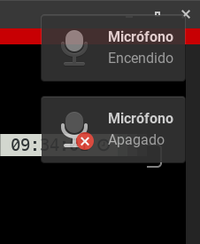

# Instalación de Herramientas Necesarias para el Script en Linux



Para utilizar el último script en otra máquina Linux, es importante asegurarse de tener las herramientas necesarias instaladas. El script utiliza comandos como `pacmd`, `awk`, y `notify-send`. A continuación, se presenta una guía general para verificar y, si es necesario, instalar estas herramientas en sistemas basados en Debian (como Ubuntu) y en sistemas basados en Red Hat (como Fedora):


## Debian/Ubuntu:

```bash
sudo apt-get install pulseaudio-utils libnotify-bin
```

## Fedora:

```bash
sudo dnf install pulseaudio-utils libnotify
```

## Execute:

```bash
./pulse-audio.mic.sh
```

## Info
- pulseaudio-utils: Proporciona el comando pacmd para controlar PulseAudio.
- libnotify: Proporciona el comando notify-send para mostrar notificaciones.

